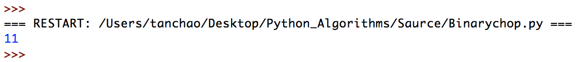

# Python_Algorithms
Python算法题

* 对以下一组数据进行降序排序（冒泡排序）。

  24，17，85，13，9，54，76，45，5，63

  ```python
  def bubbleSort(array):
      '''
      	思路：从0开始，每一次比较临近的两个元素大小，进行位置互换 
      '''
      num = len(array)
      for i in range(0, num):
          for j in range(0, (num - i - 1)):
              if array[j] < array[j + 1]:
                  tmp = array[j]
                  array[j] = array[j + 1]
                  array[j + 1] = tmp
      return array

  array = [24, 17, 85, 13, 9, 54, 76, 45, 5, 63]
  list1 = bubbleSort(array)
  print(list1)
  ```

  运行结果

  

* 对以下一组数据进行升序排序（选择排序）。

  86, 37, 56, 29, 92, 73, 15, 63, 30, 8 

  ```python
  def selectSort(array):
      '''
      	思路：每一次查找最小的一个数字转移到第一位 
      '''
      num = len(array)
      for i in range(0, num - 1):
          index = i
          for j in range(i + 1, num):
              if array[index] > array[j]:
                  index = j
          if index != i:
              tmp = array[i]
              array[i] = array[index]
              array[index] = tmp
      return array
  # 对以下一组数据进行升序排序（选择排序）。“86, 37, 56, 29, 92, 73, 15, 63, 30, 8”
  array = [24, 17, 85, 13, 9, 54, 76, 45, 5, 63]
  selectSort(array)
  print(array)
  ```

  运行结果：

  

* 二分法查找

  从数组[1,2,3,4,5,6,7,9,20,99,108,120,369,598] 找出108

  ```python
  def binSort(array, goalNum , lowerlimit, toplimit):
      '''
      思想：每一次取中间元素去和目标值进行比较，确定上下限
      :param array: 数组
      :param goalNum: 目标元素
      :param lowerlimit: 下限
      :param toplimit: 上限
      :return: 目标元素的下标
      '''
      if lowerlimit < toplimit:
          mid = int((toplimit + lowerlimit)/2)
          if goalNum == array[mid]:
              return mid + 1
          else:
              return binSort(array,goalNum,mid+1,toplimit) if (goalNum > array[mid]) else binSort(array,goalNum,lowerlimit,mid-1)

  array = [1,2,3,4,5,6,7,9,20,99,108,120,369,598]
  index = binSort(array,goalNum= 108, lowerlimit = 0, toplimit= len(array)-1)
  print(index)
  ```

  运行结果：

  
