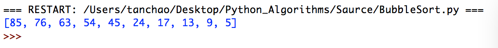

# Python_Algorithms
python算法题

* 对以下一组数据进行降序排序（冒泡排序）。

  24，17，85，13，9，54，76，45，5，63

  ```python
  def bubbleSort(array):
      num = len(array)
      for i in range(0, num):
          for j in range(0, (num - i - 1)):
              if array[j] < array[j + 1]:
                  tmp = array[j]
                  array[j] = array[j + 1]
                  array[j + 1] = tmp
      return array

  array = [24, 17, 85, 13, 9, 54, 76, 45, 5, 63]
  list1 = bubbleSort(array)
  print(list1)
  ```

  运行结果

  

* 对以下一组数据进行升序排序（选择排序）。

  86, 37, 56, 29, 92, 73, 15, 63, 30, 8 

  ```python
  def selectSort(array):
      num = len(array)
      for i in range(0, num - 1):
          index = i
          for j in range(i + 1, num):
              if array[index] > array[j]:
                  index = j
          if index != i:
              tmp = array[i]
              array[i] = array[index]
              array[index] = tmp
      return array
  # 对以下一组数据进行升序排序（选择排序）。“86, 37, 56, 29, 92, 73, 15, 63, 30, 8”
  array = [24, 17, 85, 13, 9, 54, 76, 45, 5, 63]
  selectSort(array)
  print(array)
  ```

  ​